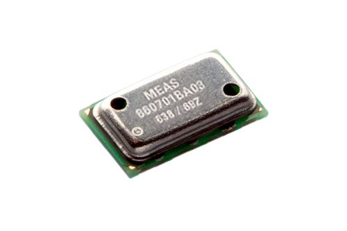

# ms8607


A platform agnostic Rust driver for the MS8607 Pressure, Temperature, and Humidity Sensor from TE Connectivity.



Tested and works great with the Adafruit MS8607 Breakout Board :


## Example

There is an example for the Raspberry Pi Pico board in the `examples` directory.

## Usage

Using the `ms8607` driver in your own project is possible with any platform that supports the [embedded-HAL](https://github.com/rust-embedded/embedded-hal). See [awesome-embedded-rust](https://github.com/rust-embedded/awesome-embedded-rust#hal-implementation-crates) for a list of supported platforms.

In order to use the `ms8607` driver you'll need to configure an I2C device that implements the [embedded HAL blocking I2C traits](https://docs.rs/embedded-hal/latest/embedded_hal/blocking/i2c/index.html). You'll also need a delay device that implements the [embedded HAL blocking delay traits](https://docs.rs/embedded-hal/latest/embedded_hal/blocking/delay/index.html).

I recommend to use the [`shared-bus`](https://crates.io/crates/shared-bus) crate in order to manage the concurrency on the I2C bus if several sensors are used in your project. Unfortunately I haven't found an equivalent for `Delay` yet and it will have to be passed to each call to a function requiring to wait before reading the sensor response.

```rust
// Create a new instance of the MS8607 driver
let mut ms8607 = MS8607::new(i2c);
// Initialize and calibrate the sensor
let begin = ms8607.begin(&mut delay);
// Init OK, sensor foun

// Get measurements
let (pres, temp, hum) = ms8607.get_measurements(&mut delay).unwrap();
hprintln!("Pressure: {pres:.2} Pa, Temperature: {temp:.2} C, Humidity: {hum:.2} %RH\r");
```

## About this crate

Written by Antoine Raulin for the [HydroVinci](https://github.com/HydroVinci-PULV)'s [MicroTransat](https://github.com/HydroVinci-PULV/MicroTransat) project, a student association at the [ESILV](https://esilv.fr).
